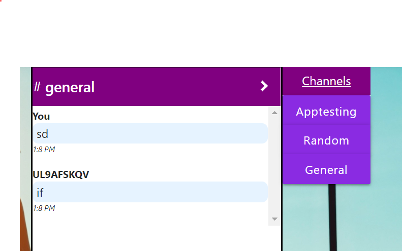

# Python Live Project
## Introduction
While studying Python with the Tech Academy, I joined a team of other students on a two-week sprint to roll out two MVT web apps using Django.  The first of these, DataScrape, collects pertinent information such as weather, news, and restaurants from across the Web and delivers it to the user in a single compact application. The second app, TravelScrape, operates on the same model but with a narrower scope towards information that would be useful to someone planning a trip, such as flights, hotels, and travel advisories. Not only did I get the opportunity to work on a number of rewarding user stories, but I also got first-hand experience working with project managers and colleagues and familiarizing myself with management software such as Azure DevOps.

A few weeks later, I returned to the TravelScrape project for a second sprint. This time my mission was to harness Slack's APIs to create a live chat feature on our own app. While working on this assignment, I greatly deepened my understanding of Django as a server, communicating between client-side and server-side code, the breadth of available Python packages and APIs, and how to choose the best way forward from a multitude of viable options.


## DataScrape

### Flexible Craigslist Searching
The shopping app in our DataScrape project uses BeautifulSoup to collect Craigslist postings in response to user searches.  The first iteration of the app only returned results near Portland, Oregon, and my task was to expand the functionality to allow for flexible location searching. This proved a challenge because Craigslist uses a different website for each of it's locations, each with it's own URL. The first step was to figure out which cities have Craigslist sites, and to then match them to their respective URLs. A little research led me to a Google site with a table of all Craigslist locations, and I scraped this table for city names and URLs using the following code:

```Python
#Get location URL
def selectLocation(input):
        source = "https://sites.google.com/site/clsiteinfo/city-site-code-sort"  #site listing all Craigslist sites by location
        response = requests.get(source)
        soup = BeautifulSoup(response.content, 'lxml')
        locationsTable = soup.find("td", {"class" : "sites-tile-name-content-1"}).tbody.findAll("tr")  #isolate the table from the source page
        for location in locationsTable:
            link = location.select('td')[3].get_text(strip=True)
            name = location.select('td')[4].get_text(strip=True)
            if name == input:
                return link
```
I then adjusted the original search URL, which directed searches to Portland's Craigslist, to instead send requests to the site that matches the user's search.  The asteriks mark where I edited the code.

```Python
def craigslistsearch(request):
    # Define website URL with empty spaces for input variables
    **url = "{}/search/sss?query={}&search_distance={}"**
    #&postal={}"

    # Pulls up blank SearchForm when user visits page
    if request.method == 'GET':
        form = SearchForm(initial = {'keyword': 'ex: Trampoline'})
        context = {'form' : form}
        return render(request, 'CraigslistApp/craigslist.html', context)

    # Once form is filled out and "Search" button is pressed, form data is saved
    elif request.method == 'POST':
        form = SearchForm(request.POST)
        form.save()

        search = Search.objects.filter().order_by('-id')[0] # Gets latest data from Search model to use in building new URL
        **location = selectLocation(search.location)**
        **response = requests.get(url.format(location, search.keyword, search.radius))** # Formats Search model data into new URL and gets HTML info
```


## TravelScrape

### Building the Dashboard App
I was tasked with laying the groundwork of the Dashboard App that serves a the central hub of the TravelScrape Program. The Dashboard provides the interface from which users can access all of their other apps.  This was mostly a front-end project, although I did need to set-up the proper URL configuration and connect the Dashboard links to a "dummy app" until the actual TravelScrape apps were ready for use.

```HTML


Dashboard





<h2 class="text-center">Welcome to TravelScrape!</h2>

<div class="row mx-auto appRow">
    <div class="col">
        <a href="DummyApp/dummy" class="text-center"><i class="fas fa-plane-departure fa-5x"></i><br>Flights</a>
    </div>
    <div class="col">
        <a href="/hotels" class="text-center"><i class="fas fa-hotel fa-5x"></i><br>Hotels</a>
    </div>
    <div class="col">
        <a href="/dummy" class="text-center"><i class="fab fa-slack fa-5x"></i><br>Slack</a>
    </div>
    <div class="col">
            <a href="/ToDoListApp" class="text-center"><i class="fas fa-tasks fa-5x"></i><br>To-Do List</a>
    </div>
```

### Building the Hotels App
I created an app that uses the Amadeus API to find hotel offers near a given city. The app gives users the hotel's name, star-rating, address, cost per night, and if available, a little information blurb.  My biggest challenge was that Amadeus takes input in the form of city aiport IATA codes, and because I knew users were more likely to enter a city name, I had to find a way to match city names to the relevant codes.  I did this by scraping Wikipedia's airport listings and dumping the information into a .csv file that ultimately contained information for 8904 unique airports. I used a .csv file, rather than taking data directly from the BeautifulSoup response, because it was far easier to have all of the data on the same page.

```Python
# Used to collect initial data. In case the .csv file ever gets deleted, running this for each letter of the alphabet will recreate it. You will need to move it to the HotelApp/resources folder.
def scrape(input): #Input must be a capital letter
    source="https://en.wikipedia.org/wiki/List_of_airports_by_IATA_code:_{}".format(input) #Uses BeatifulSoup to scrape data from Wikipedia.
    response = requests.get(source)
    soup = BeautifulSoup(response.content, 'lxml')
    database = soup.find("tbody").findAll("tr")
    for entry in database:
        try:
            code = entry.select('td')[0].get_text(strip=True) 
            code_bare = code.split("[")[0]  #This removes the footnote references that are attached to some of the entries on Wikipedia.
            city = entry.select('td')[3].get_text(strip=True)
            with open("airports.csv", "a") as logger:
                logger.write("\n" + code_bare + "," + city)
        except:
            continue
```

I could then iterate through this list to find the entry that matched the user's search. I dealt with cases in which the city name on Wikipedia contained accented characters, which I didn't want to interfere with the matching, by creating another column in the .csv with all accents removed. The app could thereby process requests without accent marks, and still return the properly accented city name in the response. I also realized that for cities with multiple airports, my code would only return the alphabetically first match, which might not be the code that Amadeus uses to reference that city. I handled this issue by creating an intermediary screen between the search and the returned results, so that the user can select from a list of cities that match their search.  This solution also addressed any duplicate city names.

```Python
def findMatches(request):
    with open("./HotelApp/resources/airports.csv") as database:
        reader = csv.reader(database)
        results = {}
        for row in reader:
            if request in row[1] or request in row[4]:   #row 4 contains place names stripped of accented characters, to make those characters unnecessary when searching.
                if row[3] != "":  #There will be no row[3] for entries that have no state names.
                    city = "{}, {}, {} - ({}) ".format(row[1],row[2],row[3],row[0])
                else:
                    city = "{}, {} - ({}) ".format(row[1],row[2],row[0])
                results[city] = row[0]
    return results
    
 
def hotelIndex(request):
    # Creates blank form on initial page load
    if request.method == 'GET':
        form = SearchForm(initial = "")
        context = {'form' : form}
        return render(request, "HotelApp\index.html", context)
            
    elif request.method =='POST':
        form = SearchForm(request.POST)
        form.save()

        search = Search.objects.filter().order_by('-id')[0]
        cities = findMatches(search.destination)
        context = {'cities' : cities, 'form': form}
        return render(request, "HotelApp\index.html", context)


def hotelSearch(request, IATA):
    form = SearchForm(initial = "")
   #Initialize Amadeus
   ## SECRET KEY INFO HERE
    response = amadeus.shopping.hotel_offers.get(cityCode = IATA)
    with open("log.json", "w+", encoding="utf-8") as log:
        json.dump(response.data, log, indent=2)
    result = response.data
    context = {'form' : form, 'results' : result}
    return render(request, "HotelApp\index.html", context)
```

## Slack on TravelScrape

Incorporating live chat functionality into TravelScrape presented two sets of challenges. The first involved communicating between my local Django server and the Slack server. The second involved dynamically displaying the chat messages on the webpage, to create a chat feature along the lines of applications like Facebook Messenger. By the end of the sprint I'd created a very rudimentary messaging app for future sprints to build upon.

### Communicating with Slack

Slack offers three APIs that allow users to post messages to channels, the Web API, the Real-Time Messaging (RTM) API, and the Events API. Initially, the documentation, mostly written in cURL rather than Python or JavaScript, was overwhelming and I didn't know where to begin. I even explored other avenues for messaging, such as SignalR, but eventually found that if I could learn to translate the cURL into a language I could understand, Slack offered the best way forward.  Through the translation process, I learned that APIs the APIs were language independent, and it was up to me how I wanted to communicate with them.

During my first attempt to send messages, I wrote a Python query to the Web API, Slack's simplest and easiest to use API.

```Python
def sendMessage(text):
        url = "https://slack.com/api/chat.postMessage"
        headers = {
                "Authorization": f"Bearer {token}",
        }
        message = {
                "text" : text,
                "channel" : "CL8Q6SDA",
                "Content-type" : "application/json"
        }
        r = requests.post(url, message, headers=headers)
```

This code did successfully send my message to Slack, but it ran into issues when trying to asynchronously update my page so that each new message would be rendered in a chat box, as below:



So I decided to make a JavaScript AJAX call with

```JavaScript
        function Slack_send_message(input){
            var Bot_token = Python_to_js("Slack_bot_token");
            var url = "https://slack.com/api/chat.postMessage";
            var token = Bot_token;
            var channel = document.getElementById("Slack_chosen_channel").innerText;
            var text = document.getElementById(input).value;

            $.ajax({
                data: {
                    "token" : token,
                    "channel":channel,
                    "text":text,
                },
                dataType: 'text',
                type:'POST',
                url: url,
                crossDomain: true,
                error: function(xhr, status, error){
                    console.log("error:" + error);
                },
                success: function(data){
                    console.log("result: " + data);
                    document.getElementById(input).value = "";
                },
            });

        };
```
For an authorization token, this code employs a variable stored in Django's settings.py, which I captured for JavaScript by writing a function to read the contents of a hidden <div> containing a Django template variable. 
        
To receive messages, I turned to Slack's Events API, which allowed me to subscribe to a message 'event' that sends JSON to my app every time a new messages was posted.  I set it up with the following code, using NGROK to turn my local Django URL into a public URL accessible by Slack.

```Python
SLACK_VERIFICATION_TOKEN = getattr(settings,'SLACK_VERIFICATION_TOKEN',None)
SLACK_OAUTH_TOKEN = getattr(settings,'SLACK_OAUTH_TOKEN',None)
SLACK_BOT_USER_TOKEN = getattr(settings,"SLACK_BOT_USER_TOKEN",None)
SLACK_BOT_NAME = getattr(settings, "SLACK_BOT_NAME",None)
Client = WebClient(SLACK_BOT_USER_TOKEN)

class Slack(APIView):
        def post(self, request, *args, **kwargs):
                slack_message = request.data
                if slack_message.get('token') != SLACK_VERIFICATION_TOKEN:
                        
                        return Response(status=status.HTTP_403_FORBIDDEN)
                       
               

                # verification challenge
                if slack_message.get('type') == 'url_verification':
                        return Response(data=slack_message, status=status.HTTP_200_OK)


                # watch events
                if 'event' in slack_message:
                        event_message = slack_message.get('event')
                        print(event_message)

                        #process user's message, differentiate incoming and outgoing
                        username = event_message.get('username')
                        if username == SLACK_BOT_NAME:  
                                with open(r".\SlackApp\json\outgoing_events.json","w+") as file:
                                        file.write(json.dumps(event_message, indent=2))
                        else:
                                with open(r".\SlackApp\json\incoming_events.json","w+") as file:
                                        file.write(json.dumps(event_message, indent=2))
                        
                return Response(status=status.HTTP_200_OK)
```
        
        Both the send and receive requests returned a JSON object that I needed to manipulate both client-side, in JavaScript, and server-side, in Python. I therefore used Python to create two .JSON files to serve as a link between my JavaScript and Python functions.
        
```Python
def outgoing_events(request):
        with open(r".\SlackApp\json\outgoing_events.json","r+") as file:
                content = file.read()
        print(content)
        return HttpResponse(
                content,
                content_type='text',
                status=200
        )

def incoming_events(request):
        with open(r".\SlackApp\json\incoming_events.json","r+") as file:
                content = file.read()
        print(content)
        return HttpResponse(
                content,
                content_type='text',
                status=200
        )
```

Then, whenever I called my JavaScript "Slack_send_message" function, I used a Django url to also call the Python function to update the .JSON file.

```JavaScript
function Slack_receive_outgoing(input){
    var promise = new Promise(function(resolve, reject){
            resolve(Slack_send_message(input));
        }
    );
    promise.then(setTimeout(function(){
        Slack_receive_message('\\SlackApp\\func_outgoing_events','Slack_sent');} ,1000)
    )};

function Slack_read(file){
    var rawfile  = new XMLHttpRequest();
    var content;
    rawfile.open("GET",file,false);
    rawfile.onreadystatechange = function(){
        if (rawfile.readyState === 4){
            if(rawfile.status === 200 || rawfile.status === 0){
                content = rawfile.responseText;
            }
        }
    }
    rawfile.send(null);
    return content;

}

function Slack_receive_message(file, io){
    const data = Slack_read(file);
    const Jdata = JSON.parse(data);
    console.log(Jdata);
    var message = `
    <div class="Slack_message ${io}">`
        
    if (io == "Slack_sent"){
        message += `
        <p>You</p>`
    }
    else{
        message += `
        <p>${Jdata['user']}</p>`
        
    }
    message += `
        <p>${Jdata['text']}</p>
        <p>${Slack_time()}</p>
        </div>`
    $("#Slack_body").append(message);
}
```
With the addition of a Django view and template, I'd now developed the base for my first real-time messaging app.

